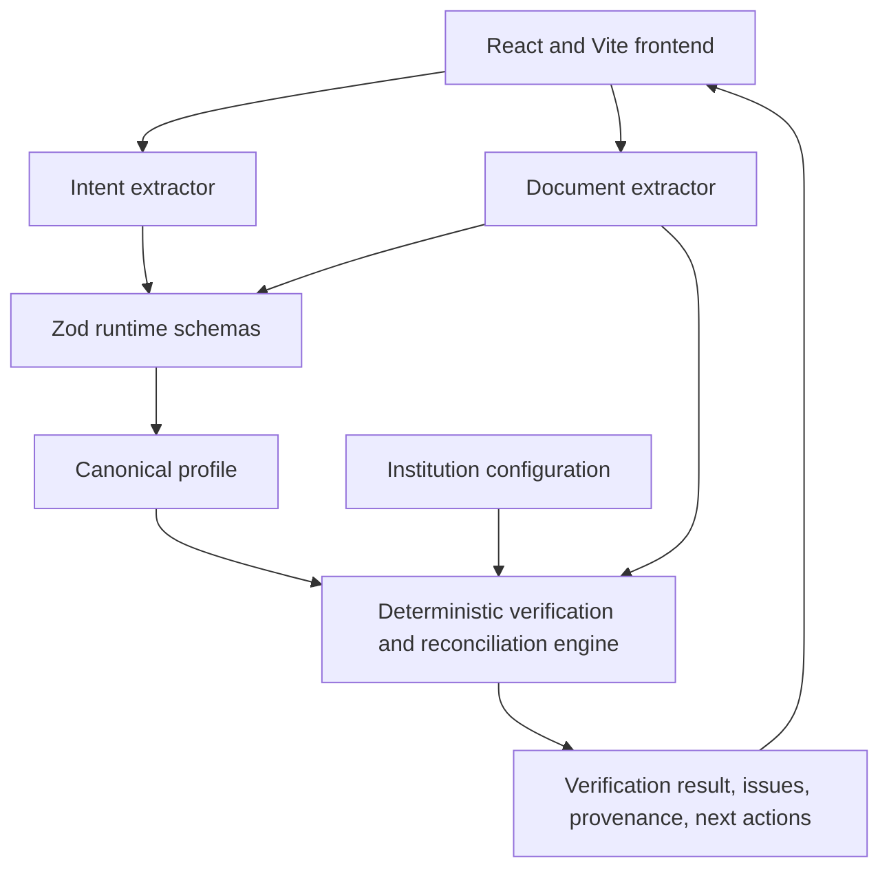

# Pre-Flight

Pre-Flight is a preparation layer for personal-loan applications. It helps a user understand what they have said, see what information is missing, verify optional supporting evidence, and resolve discrepancies before submitting an application.

It is deliberately not a lending decision system. It does not predict approval, eligibility, rejection, credit risk, or a lender's final decision.

## The idea

Loan applications often become difficult before the lending decision even begins. A user may describe their request naturally, omit a required detail, upload a document with a different salary amount, or have a genuine explanation for the difference because their salary changed.

Pre-Flight turns that uncertainty into a visible preparation journey:

```text
Natural-language request
        |
        v
Structured application information
        |
        v
Preparation checks
        |
        v
Optional document evidence
        |
        v
Discrepancy explanation and reconciliation
        |
        v
Deterministic re-verification
        |
        v
Clear application state and next action
```

The product's central promise is simple: help someone become ready before they apply.

## What the user experiences

### 1. Explain the application naturally

The user can begin with a sentence such as:

```text
I need Rs. 3 lakh for 24 months. I earn Rs. 60,000 and have an EMI of Rs. 7,000.
```

Pre-Flight shows a short, calm understanding transition. The original request remains visible while the returned profile values are revealed as:

- Loan amount
- Loan tenure
- Monthly income
- Existing EMI
- Employment type, when available

The values shown in this transition come from the same canonical profile that later powers the dashboard. Unknown values remain missing; the frontend does not invent them.

### 2. Review one application cockpit

The Application Preparation dashboard brings the whole journey together:

- application summary
- information checks
- contextual attention and next action
- representative lender context
- optional supporting documents
- discrepancy review
- evidence chain
- re-verification result

Documents and next actions are intentionally part of the application workflow instead of separate dashboard destinations.

### 3. Understand a discrepancy before correcting it

When a document and a declared value differ, the user is not immediately asked to guess which number is correct. The flow first asks what explains the difference:

- My salary changed recently
- I meant my take-home salary
- Other context-specific explanations where supported

Correction is a separate, explicit action. If the user wants to change the original application information, the editor starts from the current canonical value and sends the change through the existing re-verification flow.

### 4. Upload evidence without leaving the application

Supporting documents are optional and remain inside Application Preparation. The upload flow:

1. Opens the native file picker.
2. Shows the selected filename.
3. Extracts structured evidence through the existing document adapter.
4. Runs journey evaluation and re-verification with the complete document set.
5. Replaces the previous result with the returned verification state.

An uploaded document is never treated as verified merely because extraction succeeded.

## Reconciliation scenarios

### Revised salary slip only

Pre-Flight supports a user who does not have a separate salary revision letter. The user selects **My salary changed recently**, chooses **Salary slip**, and explicitly confirms the meaning of the explanation: the original declared amount was their previous salary.

With that confirmation, the deterministic engine preserves both values:

```text
Original declaration:  Rs. 80,000
Current salary slip:   Rs. 1,26,000
Explanation:           Salary changed recently
Result:                Explained and re-verified
```

The original declaration is not overwritten. It remains in the reconciliation record as historical application context, while the current salary slip remains document evidence.

### Salary revision evidence

If a salary revision letter or HR salary certificate is available, the engine can validate a full chain:

```text
User declaration
        |
        v
Previous salary -> Revised salary -> Effective date
        |
        v
Current salary slip
        |
        v
Explained
```

The returned reconciliation retains source filenames, field names, source labels, and page numbers where the extractor provides them.

### Gross versus net income

Gross monthly income and net or take-home income are separate semantic fields. A difference between gross salary and take-home salary is not automatically treated as a contradiction. The existing engine can verify a take-home interpretation when the available salary-slip and bank-statement evidence supports it.

### Insufficient evidence

Uploading a document does not guarantee resolution. For example, uploading the same current salary slip as a salary-change explanation may confirm the current salary while failing to establish that the originally declared value was a previous salary. In that case Pre-Flight keeps the issue visible and requests more appropriate evidence or clarification.

## Architecture

Pre-Flight uses a hybrid architecture with a strict responsibility boundary:



### AI and deterministic responsibilities

| Responsibility | Implemented by |
| --- | --- |
| Interpret natural-language input | Intent extractor adapter |
| Extract facts from a document | Document extractor adapter |
| Validate model and document output | Zod schemas |
| Normalize and retain canonical application data | Domain schema and frontend state |
| Apply institution mappings | Institution configuration |
| Compare declared and documented values | Deterministic verification engine |
| Decide status transitions | Deterministic verification engine |
| Build discrepancies and next actions | Deterministic verification engine |
| Explain an already detected issue in plain language | Explanation adapter |

The explanation layer cannot create a verification result. The engine remains the authority for `VERIFIED`, `PROVIDED`, `MISSING`, and `NEEDS_CLARIFICATION`.

## Repository layout

```text
.
├── config/                         Representative institution configurations
│   ├── hdfc.json
│   ├── idfc.json
│   └── sbi.json
├── frontend/
│   └── src/
│       ├── App.tsx                 Intake, dashboard, upload, and reconciliation UX
│       ├── api.ts                  Frontend API contracts and request wrappers
│       ├── main.tsx
│       └── styles.css               Product visual system and responsive layout
├── src/
│   ├── ai/                         Intent, document, and explanation adapters
│   ├── api/                        Express routes
│   ├── domain/                     Runtime schemas and domain contracts
│   ├── institutions/               Configuration loading and validation
│   └── verification/               Deterministic preparation engine
├── tests/
│   ├── ai/
│   ├── api/
│   ├── integration/
│   └── verification/
├── architecture.md                 Detailed architecture notes and decisions
└── package.json
```

## Running the project

### Requirements

- Node.js 18 or newer
- npm

### Install

```bash
npm install
```

### Start the application

The normal development command starts both the Express backend and the Vite frontend:

```bash
npm run dev
```

The frontend is normally available at `http://localhost:5173` and the backend at `http://localhost:3000`.

When port 5173 is already occupied, Vite may choose the next available port. Use the URL printed by Vite and make sure the browser is not still open on an older development-server port.

### Optional Gemini configuration

The application can use Gemini through the adapter boundary when `GEMINI_API_KEY` is configured. Without a key, the repository uses deterministic demo fallbacks for known synthetic scenarios. Fallback responses are explicitly marked internally as deterministic demo fallback; they are not presented as live AI output.

The fallback mode exists to make the hackathon demo reproducible and testable without requiring a provider key.

## API surface

All API errors use a stable shape:

```json
{
  "success": false,
  "error": {
    "code": "VALIDATION_ERROR",
    "message": "Readable error message"
  }
}
```

### Health

```text
GET /health
```

Returns backend liveness.

### Intent extraction

```text
POST /api/intent
```

Request:

```json
{
  "message": "I need Rs. 3 lakh for 24 months and earn Rs. 60,000 per month."
}
```

Returns a validated canonical profile and extraction-source metadata.

### Institution configuration

```text
GET /api/institutions
GET /api/institutions/:institution
```

Representative configurations currently include `hdfc_demo`, `sbi_demo`, and `idfc_demo`.

### Document extraction

```text
POST /api/documents/extract
```

Multipart fields:

- `file`
- `document_type`

Supported document types include salary slips, bank statements, salary revision letters, HR salary certificates, offer letters, appointment letters, and employment salary certificates. Supported file formats are PDF, JPG, and PNG, with a five-megabyte upload limit.

The response contains structured fields, source labels, page references, filename, document type, and extraction-source metadata.

### Journey evaluation

```text
POST /api/journey/evaluate
```

Accepts the current canonical profile, institution configuration, structured documents, and optional reconciliation context. Returns:

- information checks
- overall preparation state
- issues
- optional document requirements
- next actions
- provenance
- reconciliation details when applicable

### Issue explanation

```text
POST /api/explanations
```

Accepts an already detected structured issue and returns a plain-language explanation. It does not determine whether the issue is resolved.

### Re-verification

```text
POST /api/application/reverify
```

Accepts the latest canonical profile, institution configuration, documents, and optional reconciliation context. It reruns the same deterministic preparation engine and returns a fresh result. The frontend replaces its previous result with this response rather than appending to stale state.

## Status model

The application uses four statuses:

- `VERIFIED`: available evidence supports the information.
- `PROVIDED`: the user supplied the information, but evidence has not verified it.
- `MISSING`: required information is absent.
- `NEEDS_CLARIFICATION`: evidence conflicts with the declared information or the explanation is insufficient.

Pre-Flight does not use lending-decision language such as approved, rejected, or eligible.

## Why the prototype is stateless

This is a hackathon MVP. The backend does not maintain accounts, sessions, a database, or a document vault. The caller sends the current canonical profile, institution configuration, and structured documents to each evaluation request.

That choice is intentional:

- the demo remains easy to run locally
- uploaded files are transient
- verification behavior is reproducible
- persistence and retention are not implied to be production-ready

Productionizing this design would require authentication, encrypted storage, retention and deletion policies, access control, audit logging, provider governance, and institution integrations.

## Security and trust boundaries

- Uploaded documents are treated as untrusted data.
- Extracted values must pass runtime schema validation before entering verification.
- Document content cannot modify institution mappings, statuses, or permissions.
- AI adapters interpret or extract facts; deterministic code decides verification state.
- The application does not perform a lending decision.
- The prototype does not include authentication or persistent financial-data storage.

## Validation

Run the full local validation suite:

```bash
npm run typecheck
npm test
npm run build
npm run build:frontend
```

The automated suite covers:

- natural-language intent extraction and fallback behavior
- malformed model output
- document extraction boundaries
- required information and optional document behavior
- gross and net income semantics
- mismatches and deterministic differences
- corrections and stale-issue clearing
- multiple-document evaluation
- salary revision and recent job-change reconciliation
- confirmed revised-salary-slip reconciliation
- provenance preservation
- institution configuration behavior
- API health and integration flows

## Suggested submission walkthrough

1. Start the app with `npm run dev`.
2. Enter a natural-language loan request.
3. Watch the understanding transition reveal the structured application information.
4. Continue to Application Preparation.
5. Upload a salary slip to create a real mismatch.
6. Choose **My salary changed recently**.
7. Choose **Salary slip** and upload the updated salary slip.
8. Review the extraction and re-verification transition.
9. Confirm that the original declaration remains visible in reconciliation history while the current salary is verified.
10. Confirm that the clarification panel disappears after successful reconciliation and the normal dashboard returns.
11. Repeat with insufficient evidence to demonstrate that the application remains in `NEEDS_CLARIFICATION` rather than falsely resolving the issue.

## What this prototype does not claim

Pre-Flight is not:

- a loan approval system
- a credit-scoring system
- an eligibility predictor
- a lender recommendation engine
- a bank integration
- a document vault
- an account or application-history system
- a production financial-data processing platform

It is a preparation and verification layer that makes application information, evidence, discrepancies, and next actions easier to understand before submission.

## Further documentation

- [architecture.md](architecture.md) describes component boundaries, data flow, trust boundaries, and architectural decisions.
- [PROJECT_HANDOFF.md](PROJECT_HANDOFF.md) records the implemented product flow and current MVP behavior.
