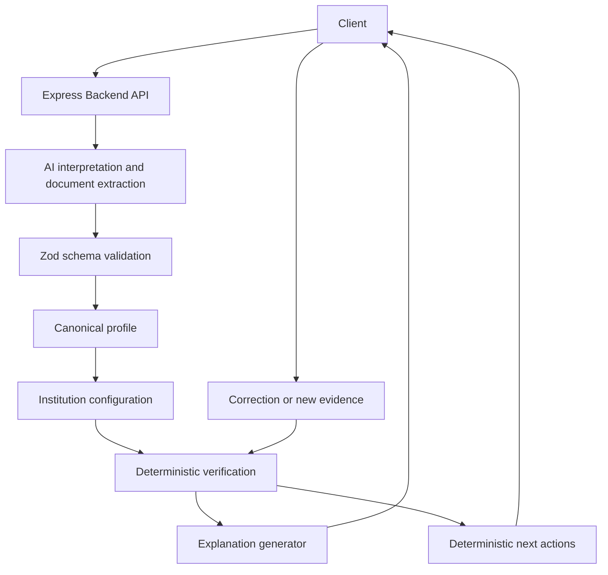

# Paytm Pre-Flight Architecture

## 1. Architecture Overview

Pre-Flight is a preparation-state linter for a personal-loan application. The backend normalizes user intent into an institution-independent canonical profile, resolves representative institution requirements, compares structured evidence with deterministic code, and exposes explanations and next actions. It never makes approval, rejection, eligibility, credit-scoring, or lender-recommendation decisions.

The repository is backend-only at this stage. The MVP uses request-scoped structured data and synthetic documents; it does not require a persistent database, session store, or document vault.

## 2. Architecture Diagram

## 3. Component Responsibilities

- `src/app.ts`: Express application factory, JSON parsing, health check, and stable 404/error responses.
- `src/server.ts`: Environment loading and process startup only.
- `src/domain`: Canonical profile, semantic field, status, document, issue, and verification-result schemas.
- `src/institutions`: Validated representative configurations and canonical-to-institution mappings.
- `src/verification`: Completeness, semantic comparison, discrepancy calculation, status transitions, and next actions.
- `src/ai`: Small interfaces plus Gemini and deterministic demo implementations. AI output is never trusted before schema validation.
- `src/api`: Thin HTTP adapters. Business rules stay in services and domain modules.

## 4. AI vs Deterministic Responsibility

| Responsibility | AI | Deterministic |
| --- | --- | --- |
| Natural-language interpretation | Yes | No |
| Document fact extraction | Yes | No |
| Schema validation | No | Yes |
| Canonical normalization | No | Yes |
| Institution requirements and mappings | No | Yes |
| Completeness and comparisons | No | Yes |
| Status transitions | No | Yes |
| Issue explanation | Yes, from structured facts | No |
| Next procedural action | No | Yes |

## 5. Data Flow

`POST /api/intent` interprets a message, validates the result, and returns a canonical profile plus `extraction_source`. Journey evaluation resolves a selected representative institution configuration and runs deterministic checks. Optional document extraction validates only relevant structured fields and provenance before verification consumes them; uploaded bytes are ignored by the synthetic fallback and cannot act as instructions. Missing optional evidence is returned in `document_requirements` with `verification_optional: true`, so it does not make the preparation state `MISSING`. Explanations accept an already-detected issue, and re-verification runs the same deterministic engine with updated profile/evidence.

## 6. Canonical Data Model

The canonical MVP profile contains `product`, `loan_amount`, `tenure_months`, separate `income.gross_monthly` and `income.net_monthly`, `employment.type`, `employment.employer`, `existing_emi`, and `purpose`. Unknown values are `null`; the extractor must not invent them.

## 7. Field Semantics

Gross and net income are distinct semantic fields. The system compares only the field selected by institution configuration, never gross income against net income merely because both are called income.

## 8. Institution Configuration

HDFC, SBI, and IDFC FIRST are representative demo configurations, not live integrations. Their requirements, terminology, and canonical field mappings live in configuration files so the verification engine remains reusable.

## 9. Verification Engine

The engine checks configured required fields and compares every configured canonical mapping for which document evidence exists. User input starts as `PROVIDED`; absence of optional evidence is not a discrepancy or blocking `MISSING` state. Matching evidence becomes `VERIFIED`, while a genuine numeric semantic conflict becomes `NEEDS_CLARIFICATION` with a deterministic difference and provenance. All supplied documents are considered; a later matching document can resolve an earlier conflicting document. The current representative configurations have no executable validation rules, so `validationRules: []` is intentionally descriptive of that absence rather than an inactive rule engine.

## 10. Status Model

- `VERIFIED`: available evidence supports the relevant information.
- `PROVIDED`: user supplied the information, but it is not verified.
- `MISSING`: required information or evidence is absent.
- `NEEDS_CLARIFICATION`: information conflicts or needs user review.

## 11. Provenance

Extracted values retain document identity, source label, and page where available. The MVP prefers evidence references over arbitrary AI confidence scores.

## 12. AI Provider Boundary

The application depends on small `IntentExtractor`, `DocumentExtractor`, and `ExplanationGenerator` interfaces. Gemini implementations are optional adapters; deterministic demo fallbacks support known synthetic inputs when live AI is unavailable.

## 13. Fallback Strategy

Fallback results are explicitly marked as deterministic demo fallback internally and are never represented as live AI output. Live Gemini use requires `GEMINI_API_KEY`; tests and demo fixtures do not require an API key.

## 14. Security Boundary

Uploaded documents are untrusted data. Document text cannot alter status, mappings, permissions, or business rules. Only validated structured extraction output may reach deterministic verification. Uploads are transient and synthetic-only for this MVP.

## 15. State Management

No persistent database or session store is used. The API is stateless: the caller sends the current canonical profile, institution configuration, and structured evidence to each evaluation or re-verification request. This keeps the hackathon implementation small while making persistence and retention an explicit future boundary.

## 16. API Contracts

- `GET /health`: returns `{ success: true, status: "ok" }`.
- `POST /api/intent`: message to validated canonical profile, with extraction source metadata. Uses Gemini when configured and deterministic demo fallback otherwise.
- `POST /api/documents/extract`: synthetic PDF/JPG/PNG plus document type to validated structured fields and provenance.
- `POST /api/journey/evaluate`: profile, institution configuration, and documents to checks, preparation state, issues, provenance, and next actions.
- `POST /api/journey/evaluate`: profile, institution configuration, and documents to checks, preparation state, issues, provenance, optional `document_requirements`, and next actions. Document requirements are non-blocking optional verification opportunities in this MVP.
- `POST /api/explanations`: structured issue to plain-language explanation; it cannot create or change an issue.
- `POST /api/application/reverify`: updated profile/evidence to a fresh deterministic evaluation.

All errors use `{ success: false, error: { code, message } }` and do not expose stack traces.

## 17. Testing Strategy

Vitest covers schemas, institution resolution, no-document preparation, matching and conflicting gross/net evidence, deterministic 10,000 discrepancy calculation, correction and stale-issue removal, multiple documents, institution changes, generic mappings, fallback behavior, malformed Gemini output, prompt-injection resistance, invalid JSON, unsupported uploads, and API integration flows. `npm test`, `npm run typecheck`, and `npm run build` are the required validation commands.

## 18. Known MVP Limitations

- The demo extractor returns fixed synthetic salary-slip values; it does not parse arbitrary real documents.
- Gemini is integrated through direct HTTP adapters, but production provider governance, retries, quotas, and data-handling assessment are outside the hackathon scope.
- No session state or original document is retained by the backend between requests.
- Numeric field discrepancies are supported; full cross-document reconciliation and arbitrary institution rule execution remain future work.
- There is no frontend, authentication, account history, or production-grade financial-data security layer.

## 19. Architectural Decisions / ADR-style Log

### Decision: Express with TypeScript

Context: The MVP needs a small Node.js HTTP API in an approximately eight-hour build.

Decision: Use Express and strict TypeScript.

Alternatives considered: Next.js API routes or a larger server framework.

Why this choice: Express makes the API boundary explicit and keeps backend concerns independent from the future frontend.

Trade-offs: We own a little more routing and validation plumbing than with a batteries-included framework.

Consequences: Route handlers must remain thin and delegate business behavior to domain/services.

### Decision: Zod at every trust boundary

Context: Requests, uploaded metadata, and model output are untrusted.

Decision: Validate API payloads, AI output, documents, configurations, and verification results with Zod.

Alternatives considered: TypeScript types alone or JSON Schema tooling.

Why this choice: TypeScript types disappear at runtime; Zod provides one readable runtime/schema boundary.

Trade-offs: Schemas require maintenance alongside domain types.

Consequences: No unvalidated AI or document-derived value may enter verification.

### Decision: No persistent database in the MVP

Context: The PRD requires temporary state and synthetic, transient document processing.

Decision: Use in-memory application/session state.

Alternatives considered: PostgreSQL, object storage, or a document vault.

Why this choice: It preserves the requested scope and avoids implying production financial-data handling.

Trade-offs: State is lost on restart and cannot support accounts or history.

Consequences: Persistence, retention, and production security remain explicit future work.

### Decision: Deterministic verification

Context: Preparation status and discrepancies are critical product behavior.

Decision: AI interprets; deterministic code maps, compares, transitions status, and creates next actions.

Alternatives considered: Asking an LLM whether a discrepancy is acceptable.

Why this choice: Deterministic rules are testable, explainable, and prevent probabilistic lending judgments.

Trade-offs: Institution rules must be modeled explicitly in configuration.

Consequences: The same engine can support multiple representative institutions without duplicating verification logic.

### Decision: Optional document verification is non-blocking

Context: The PRD requires value before data and a usable no-document path.

Decision: Representative document requirements are returned as optional verification opportunities; missing evidence does not create a discrepancy or block preparation.

Alternatives considered: Treat every configured document as a blocking required check.

Why this choice: A user can see what may help verify their information and continue without uploading sensitive data.

Trade-offs: The backend must distinguish missing profile information from absent evidence metadata.

Consequences: `document_requirements` exposes `provided` and `verification_optional` separately from core preparation statuses.

How to explain this to a judge: “The user gets useful preparation value before sharing a document; uploading evidence is an explicit choice, not a gate.”

### Decision: Generic configured field comparisons

Context: Institution mappings must not be hardcoded around one field name.

Decision: The verifier resolves dotted canonical paths from configuration and compares each mapped field against its configured document field.

Alternatives considered: Separate verifier branches for income, employment, and each bank.

Why this choice: It preserves semantic mappings and lets the same deterministic engine operate across representative configurations.

Trade-offs: Configuration must use valid canonical/document field paths, and the MVP discrepancy model remains numeric.

Consequences: A later matching document can resolve an earlier conflict, and no gross/net cross-comparison occurs.

How to explain this to a judge: “We normalize the customer once, then configuration selects the exact semantic field each institution wants checked.”

### Decision: Synthetic documents only

Context: The hackathon requires data minimization and transient processing.

Decision: The demo fallback uses synthetic salary-slip and bank-statement structures and retains only validated structured facts for the current request.

Alternatives considered: Persistent document storage or arbitrary real financial-document parsing.

Why this choice: It keeps the demo safe, deterministic, and within the eight-hour MVP boundary.

Trade-offs: The fallback is not evidence of production document-processing capability.

Consequences: Production use would need secure processing, retention/deletion, access control, and provider data-handling review.

How to explain this to a judge: “The demo proves the architecture with synthetic data without pretending this prototype is a production financial document vault.”

### Decision: No executable validation-rule DSL in P0

Context: Configuration supports `validationRules`, but the representative demo files contain no rules required by the acceptance scenarios.

Decision: Keep the field in the validated configuration contract, execute no rules while every representative list is empty, and document that state explicitly.

Alternatives considered: Inventing a rule language or silently treating strings as executable business logic.

Why this choice: It avoids false claims and unnecessary infrastructure while preserving a clear extension point.

Trade-offs: Rich institution-specific validation is deferred.

Consequences: Current P0 correctness comes from required fields, mappings, semantic comparisons, and status transitions only.

How to explain this to a judge: “We only execute rules we actually need and can test; the demo configuration does not pretend descriptive strings are business logic.”